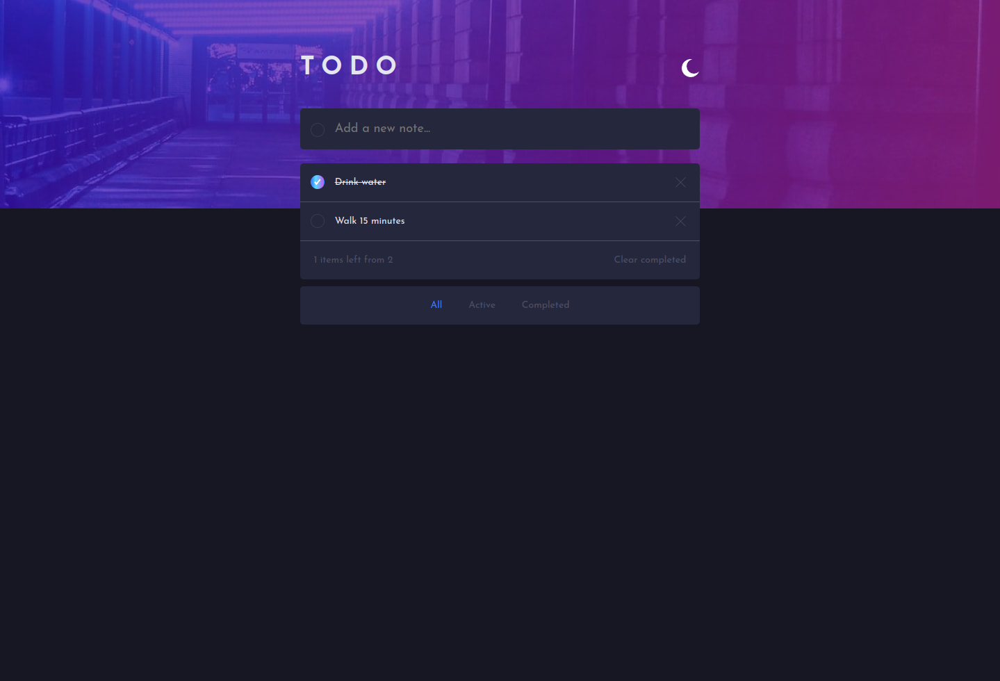

# Frontend Mentor - Todo app main solution

This is a solution to the [Todo app challenge on Frontend Mentor](https://www.frontendmentor.io/challenges/todo-app-Su1_KokOW). Frontend Mentor challenges help you improve your coding skills by building realistic projects. 

## Table of contents

- [Overview](#overview)
  - [Screenshot](#screenshot)
  - [Links](#links)
- [My process](#my-process)
  - [Built with](#built-with)
- [Author](#author)

## Overview

### Screenshot

### Links

- Solution URL: [https://www.frontendmentor.io/challenges/todo-app-Su1_KokOW/hub](https://www.frontendmentor.io/challenges/todo-app-Su1_KokOW/hub)
- Live Site URL: [https://dublop.github.io/todo-app-main/](https://dublop.github.io/todo-app-main/)

## My process

### Built with

- Semantic HTML5 markup
- CSS custom properties
- Flexbox
- CSS Grid
- Mobile-first workflow
- React

## Author

- Frontend Mentor - [@dublop](https://www.frontendmentor.io/profile/dublop)
- Twitter - [@dubraska_98](https://www.twitter.com/dubraska_98)